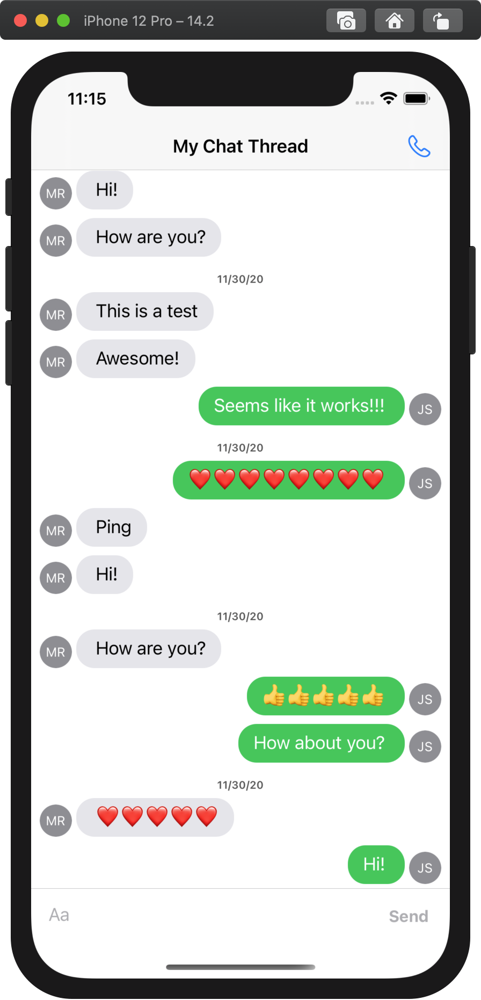

# My Messages

An iOS chat application built using the [Azure Communication Services](https://docs.microsoft.com/en-us/azure/communication-services/) and [Message Kit](https://github.com/MessageKit/MessageKit)

## Running

Replace the `RESOURCE_URL` and `USER_ACCESS_TOKEN` constants in `UserDirectory.swift` with valid values for your communinication services resource.

